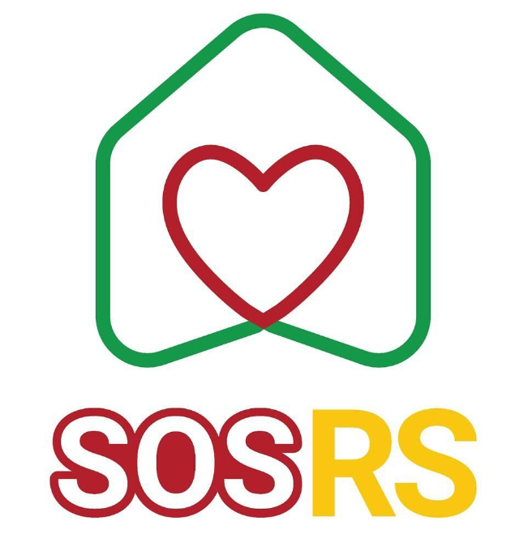
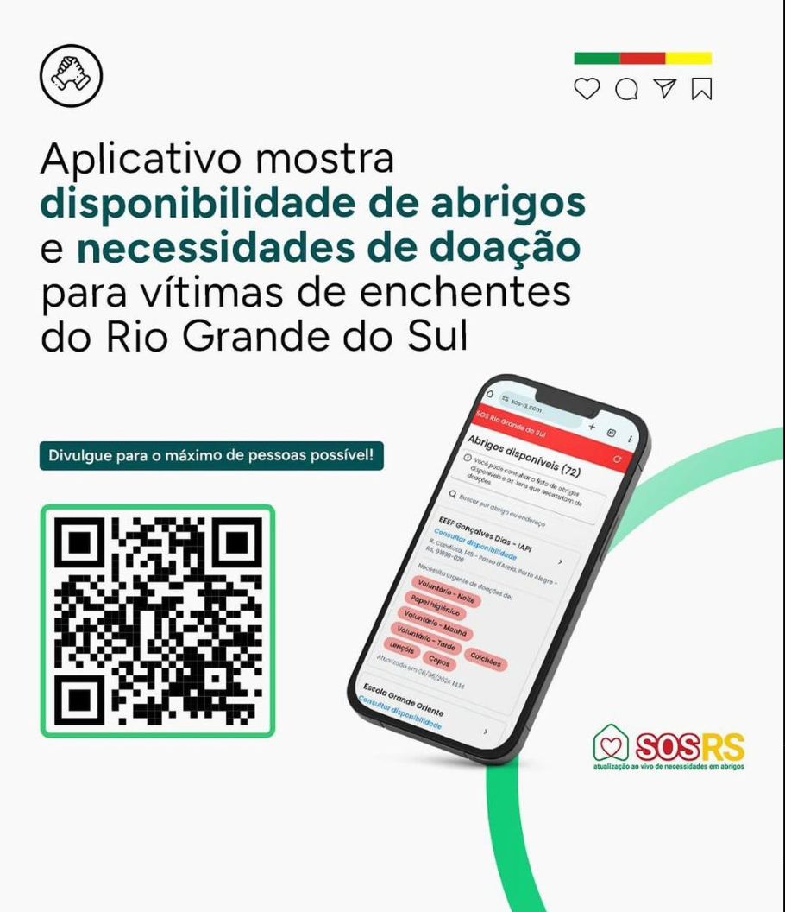

# README

Este projeto é o frontend de um aplicativo destinado a auxiliar na organização e distribuição de suprimentos, além de coordenar voluntários durante os alagamentos no Rio Grande do Sul. A aplicação visa conectar pessoas afetadas pelas enchentes com recursos essenciais e voluntários dispostos a ajudar.

## Sobre o Projeto

O objetivo deste aplicativo é facilitar uma resposta rápida e eficiente em situações de emergência causadas por enchentes, promovendo a colaboração e o apoio mútuo entre a comunidade e organizações de ajuda.

## Tecnologias Utilizadas

Este frontend foi desenvolvido utilizando as seguintes tecnologias:

- **React**: Uma biblioteca JavaScript para construir interfaces de usuário.

## Funcionalidades e Backlog

O app inclui as seguintes funcionalidades:

- [x] **Cadastro de Itens de suprimentos**: Permite que voluntários se inscrevam para ajudar.
- [x] **Busca de abrigos**: Gerencia a logística de distribuição de suprimentos para as áreas mais necessitadas.
- [x] **Alteração de necessidades de abrigos**: Exibe um mapa das áreas afetadas e pontos de coleta de suprimentos.
- [ ] **Cadastro de abrigos**: Criar tela para cadastro de abrigos (Nome, endereço, capacidade, vagas, aceita pets) e colocar pendende de aprovação.
- [ ] **Alteração de abrigos**: Pemitir alterar quantidade de vagas disponívies, se aceita pet ou endereço.
- [ ] **Cadastro de usuários**: Criar tela de cadastro (nome, telefone, senha) e login.
- [ ] **Filtro por item e por cidade**: Opção de filtrar abrigos por cidade ou que precisam de algum item específico.
- [ ] **Alterar ordenação**: Trocar a ordenação atual para ordenação por última atualização.
- [ ] **Adicionar mapa de abrigos**: Criar uma tela com um mapa e todos os abrigos. Verificar a posibilidade de usar geolocation para mostrar a posição do usuário no mapa.


Para executar o frontend do aplicativo em seu ambiente local, siga os passos abaixo:

1. Clone o repositório:
   ```
   git clone https://github.com/seuusuario/projeto-enchentes-frontend.git
   ```
2. Entre no diretório do projeto:
   ```
   cd projeto-enchentes-frontend
   ```
3. Instale as dependências:
   ```
   npm install
   ```
4. Inicie o servidor de desenvolvimento:
   ```
   npm run dev
   ```
   O app estará disponível em `http://localhost:3000`.

## Contribuindo

Contribuições são muito bem-vindas! Se você tem interesse em ajudar a melhorar o app, por favor:

1. Faça um fork do repositório.
2. Crie uma branch para sua feature (`git checkout -b feature/MinhaFeature`).
3. Faça seus commits (`git commit -am 'Adicionando uma nova feature'`).
4. Faça push para a branch (`git push origin feature/MinhaFeature`).
5. Abra um Pull Request.

---

Agradecemos o seu interesse e apoio. Juntos, podemos fazer uma diferença significativa para as vítimas das enchentes no Rio Grande do Sul!

## Conteúdo para Divulgação
### POST LONGO

O SOS-RS (https://sos-rs.com/) é um portal criado pela comunidade DEV com o objetivo de coordenar o apoio às vítimas do Rio Grande do Sul. Através deste portal, é possível acompanhar em tempo real as necessidades dos abrigos, a demanda por voluntários, as doações específicas necessárias, os excedentes disponíveis e a disponibilidade para receber desabrigados.

Este projeto é uma iniciativa valiosa que visa unir esforços para ajudar aqueles que foram afetados por desastres naturais ou outras situações de emergência. Ao fornecer informações atualizadas sobre as necessidades e recursos disponíveis, o SOS-RS desempenha um papel fundamental na mobilização da solidariedade e na prestação de assistência eficaz às pessoas em momentos difíceis.

Se você desejar saber mais detalhes sobre como contribuir ou participar dessa iniciativa, recomendo visitar o site oficial do SOS-RS. Juntos, podemos fazer a diferença e oferecer apoio àqueles que mais precisam! 🤝🌟


### POST CURTO 

Para quem está precisando cadastrar abrigo ou doações, o SOS-RS é um portal, você pode registrar informações sobre abrigos disponíveis ou doações que deseja oferecer. Assim, a comunidade pode coordenar melhor o apoio às vítimas no Rio Grande do Sul. Acesse o site  https://sos-rs.com/ para fazer o cadastro e contribuir com essa importante iniciativa! 🤝🌟




<video width="320" height="240" controls src="divulgacao/como usar.mp4" type="video/mp4"></video>
<video width="320" height="240" controls src="divulgacao/equipe sos.mp4" type="video/mp4"></video>


